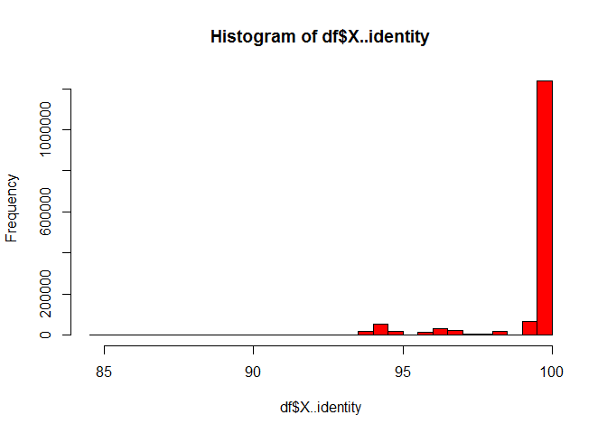
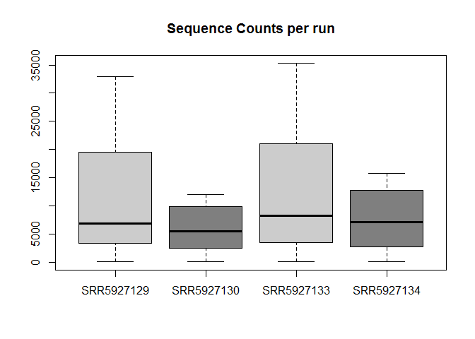
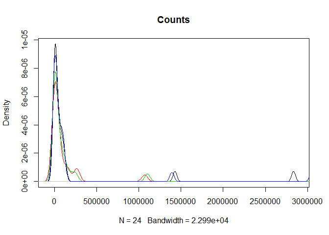
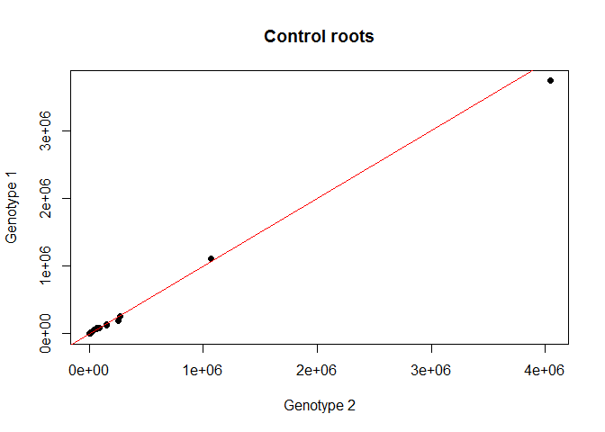
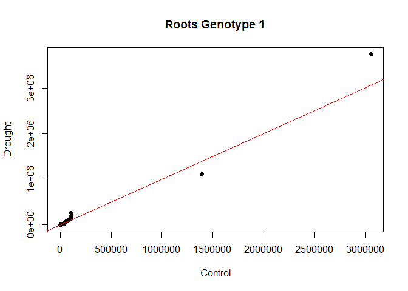
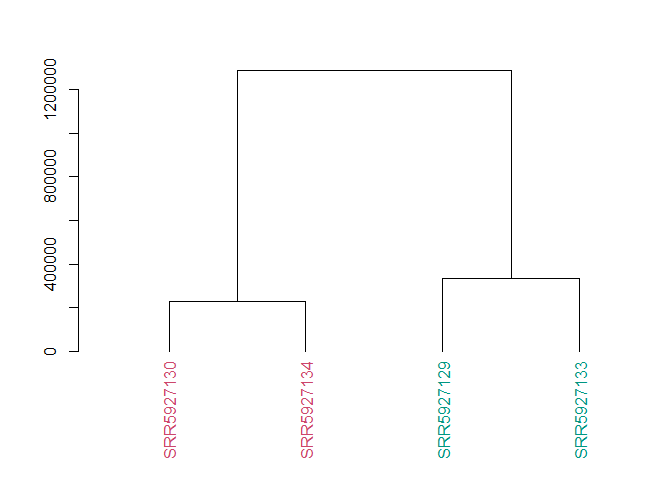
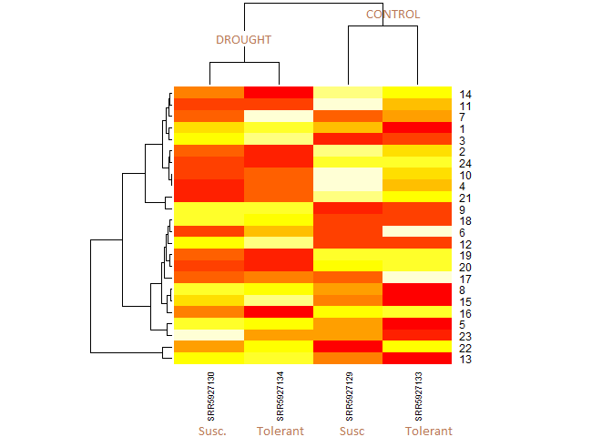

Our objective in the GeneHummmus Project is to **build an automated pipeline** that combines the accuracy of manual curation with programmatic efficiency **to identify and characterize plant gene families**.  
  
As **case study** we focused on the **Auxin Response Factors (ARFs)**. ARFs are regulators of plant growth and developmental processes in plants. ARFs are also **activated in response to biotic** (pests, diseases, virus ...) **and abiotic challenges** (heat, drought, ...). **Understanding which genes are activated in which conditions will help selective bredding programs**.  
    
Here, our starting point is a dataset made of the 24 ARF genes from the chickpea genome. We run [Magic-BLAST](https://ncbi.github.io/magicblast/) against 4 SRA libraries, representing two chickpea genotypes (susceptible and drought tolerant) under two different conditions (control roots, roots under drought). 
  
This tutorial will analyze the Magic-Blast table output.  

* [SRR5927129](https://www.ncbi.nlm.nih.gov/sra/?term=SRR5927129). Susceptible_Control
* [SRR5927130](https://www.ncbi.nlm.nih.gov/sra/?term=SRR5927130). Susceptible_Drought
* [SRR5927133](https://www.ncbi.nlm.nih.gov/sra/?term=SRR5927133). Tolerant_Control
* [SRR5927134](https://www.ncbi.nlm.nih.gov/sra/?term=SRR5927134). Tolerant_Drought


### Dependencies

```r
library(dplyr)
library(stringr)
library(tidyr)
library(dendextend)
```


### Load some functions 

```r
source("https://raw.githubusercontent.com/NCBI-Hackathons/typhoid_phages/master/R/getSize.R")
```

### Read magicBlast output table file

```r
file <- "my_magic"
```

### Read whole file

```r
df = read.delim(file, header = TRUE, sep = "\t", quote = "\"",
                dec = ".", fill = TRUE, comment.char = "")
df[1:6, 1:5]                
```

```
##   X..Fields..query.acc. reference.acc. X..identity not.used not.used.1
## 1       SRR5927133.26.1   LOC101492136     94.1176        0          0
## 2      SRR5927133.121.1   LOC101505502    100.0000        0          0
## 3      SRR5927133.121.2   LOC101505502    100.0000        0          0
## 4      SRR5927133.170.2   LOC101513952    100.0000        0          0
## 5      SRR5927133.226.1   LOC101513952    100.0000        0          0
## 6      SRR5927133.226.2   LOC101513952    100.0000        0          0
```

### Prepare the file
We can check the dimensions of our data

```r
dim(df)
```

```
## [1] 1516497      25
```

We need to clean up the name of the SRA accessions (first column) and put it into a new column. 

```r
## Clean query accessions (1st column) and create a new column
df$query <- sub("\\..*", "", df[[1]])
```

Plot the percentage Identity

```r
hist(df$X..identity, col = 2)
```

<!-- -->

We could filter some rows. For example, say we want to keep only those hits with Identity > 99%. How many hits will we remove? 

```r
I = 99
sum(df$X..identity < I)
```

```
## [1] 211910
```

Make a new dataframe with filtered rows

```r
df_filtered <- df[df$X..identity >= I,]
```

Now, we need to create a new dataframe with the sequence counts (frequency)

```r
df2 <- df_filtered %>% dplyr::select(query, reference.acc.)
df2 <- rename(df2, "Query" = "query", "Reference" = "reference.acc.")
df2 <- df2 %>% group_by(Query, Reference) %>% summarise(Count = n()) %>% ungroup()
df2[1:6,]
```

```
## # A tibble: 6 x 3
##   Query      Reference    Count
##   <chr>      <fct>        <int>
## 1 SRR5927129 LOC101489666 10545
## 2 SRR5927129 LOC101491204 32937
## 3 SRR5927129 LOC101492112  7629
## 4 SRR5927129 LOC101492136 22395
## 5 SRR5927129 LOC101492451  1842
## 6 SRR5927129 LOC101492916  4918
```


#### Plot Counts ~ SRA run

To have a general idea, we can plot the frequency of protein hits: Genotype_susceptible (control/drought), Genotype_tolerant (control/drought)

```r
boxplot(df2$Count~df2$Query, outline = FALSE, 
        main = "Sequence Counts per run", col = c("grey80", "grey50", "grey80", "grey50"))
```

<!-- -->
<br>
We see how drought conditions has an effect on the presence of the ARF proteins in both genotypes. 


Now we run some code chunks. At the end, we will have the normalized counts for each ARF sequence across the 4 SRA runs. 


```r
### Extract the number of counts per sequence (LOC) 
seq_counts_total <- df2 %>% group_by(Reference) %>% summarise(Total = sum(Count))

## Add the total counts per sequence (LOC)
df2$Ref_Total = rep(seq_counts_total$Total, 4)

## Add the size of each Run
target <- unique(df2[[1]])     # get unique queries
s_target <- getSize(target)    # get Sizes per query

# hacer un vector de match para cada query
mindex = vector(mode = "numeric", length = length(df2$Query))
for(q in seq_along(df2$Query)) {mindex[q] = match(df2$Query[q],target)}
squery = c()
for(m in mindex) {squery = c(squery, s_target[m])}

# add the size (Mb) as a new colum
df2$MbRun=as.numeric(squery)

## Normalize data based on the total counts per each ARF sequence and the size of each run
df2norm = df2 %>% mutate(NCount = Count/MbRun*Ref_Total)
df2norm = df2norm %>% group_by(Query, Reference)  %>% summarise(NC = NCount) %>% ungroup()
head(df2)
```

```
## # A tibble: 6 x 5
##   Query      Reference    Count Ref_Total MbRun
##   <chr>      <fct>        <int>     <int> <dbl>
## 1 SRR5927129 LOC101489666 10545     41068 9964.
## 2 SRR5927129 LOC101491204 32937     83066 9964.
## 3 SRR5927129 LOC101492112  7629     35852 9964.
## 4 SRR5927129 LOC101492136 22395     68572 9964.
## 5 SRR5927129 LOC101492451  1842      7025 9964.
## 6 SRR5927129 LOC101492916  4918     21751 9964.
```


We may want to reshape the format of our data. Each sample run as column: each ARF sequence as rows.

```r
## Spread df (tidyr)
df_wide = spread(df2norm, 'Query', 'NC')
head(df_wide)
```

```
## # A tibble: 6 x 5
##   Reference    SRR5927129 SRR5927130 SRR5927133 SRR5927134
##   <fct>             <dbl>      <dbl>      <dbl>      <dbl>
## 1 LOC101489666     43461.     56032.     15856.     71953.
## 2 LOC101491204    274575.    130981.    194044.    106153.
## 3 LOC101492112     27449.     38246.     29123.     43259.
## 4 LOC101492136    154117.    101171.    122954.    110635.
## 5 LOC101492451      1299.      1424.      1147.      1390.
## 6 LOC101492916     10735.     10645.     15273.     12343.
```


#### Density Plots
Density plots are useful to confirm that our data are comparable (we have sequenced with the same abundance the same thing). Let's see the distribution of counts per library. 


```r
plot(density(df_wide$SRR5927130), col = 1, main = 'Counts')
lines(density(df_wide$SRR5927129), col = 2)
lines(density(df_wide$SRR5927133), col = 3)
lines(density(df_wide$SRR5927134), col = 4)
```

<!-- -->


## QQ plot
Compare distribution of two samples to each other


```r
qqplot(df_wide$SRR5927129, df_wide$SRR5927133, pch = 19, 
       main = 'Control roots', 
       ylab = 'Genotype 1', xlab = 'Genotype 2')

abline(c(0,1), col=2) # 45degree line
```

<!-- -->


```r
qqplot(df_wide$SRR5927134, df_wide$SRR5927133, pch = 19, 
       main = 'Roots Genotype 1', 
       ylab = 'Drought', xlab = 'Control')

abline(c(0,1), col=2) # 45degree line
```

<!-- -->


## Cluster dendrogram

```r
vals = df_wide[,2:5] 
# By default, dist() function calculates the euclidean ditance-matrix and computes distance between rows.
# Because I want to know distance between samples (columns) I need the transpose matrix.
d  <- dist(t(vals))
hc <- hclust(d)
#plot(hc)

## Dressing the cluster
dend = as.dendrogram(hc)         # dependency on devtools
dend = color_labels(hc,2, 1:2)   # dependency on dendextend
my.parmar = par()$mar            # to restore default settings
par(mar=c(6,4,3,0)+0.1)
plot(dend,cex=.7)
```

<!-- -->

## Heatmap

```r
dataMatrix <- as.matrix(log2(vals))
heatmap(dataMatrix, cexCol=0.7)
```

<!-- -->
<br>

**Conclusion.** From the **magicblast analysis** and based on the heatmap  we see that samples are clustered by condition, meaning that plants response to drought. the 'drought condition' affects both genotypes. However, ARF7 abundance is not consistent between both genotypes under drought, being higher abundant y the drought tolerant genotype [SRR5927134](https://www.ncbi.nlm.nih.gov/sra/?term=SRR5927134). Tolerant_Drought. It would be interesting to test experimentally this gene in a number of different genotypes to determine its function in drought tolerance. Other ARF sequence of interest for further analysis (based on heat map) are: 22, 6, and 16. 
